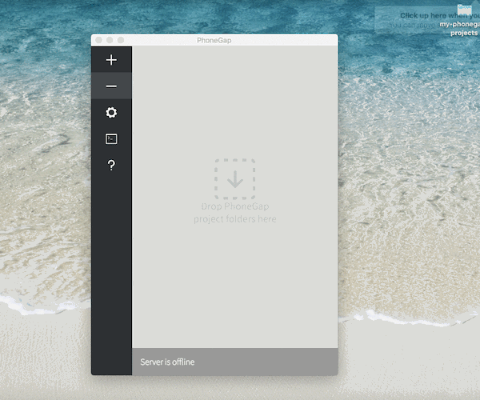
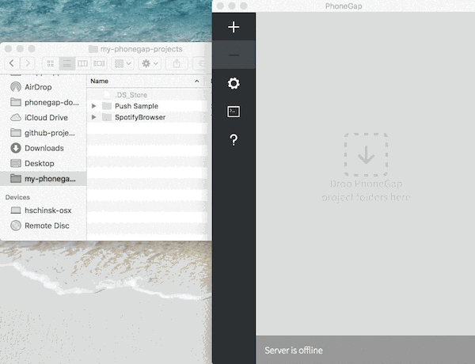
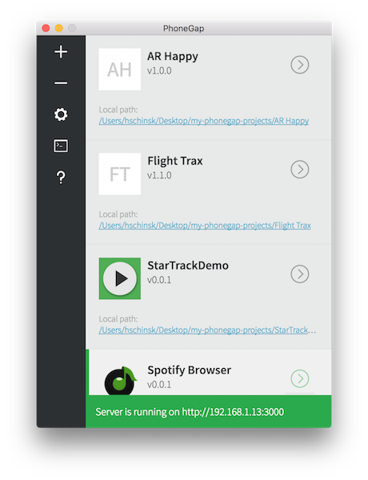

We're happy to announce the release of PhoneGap Desktop 0.4.0, with support for PhoneGap templates! These templates help you build apps quickly with popular features like Push Notifications, Augmented Reality and frameworks like React and Framework7. We've also included and recommend our [_PhoneGap Star Track_] (http://phonegap.com/blog/2016/04/21/introducing-star-track-by-phonegap/) template for those who want to get started using a more complete app example. 

## Additional Updates
In addition to the template support, we've also added some other updates worth noting:

- ### Drag and Drop Workflow
The drag and drop workflow updates in this release make it even easier to add your existing projects to PhoneGap Desktop. Simply drag a project with a valid `config.xml` into the project list workspace and it will automatically be served for testing. 

- ### Default Icon Handling
The default icon handling has undergone a big improvement as well. If your project does not contain one by default, we'll display a CSS placeholder using initials based on the app name as shown below. 

- ### CLI Integration
Another update that isn't visually noticeable but still important, is the removal of our dependency on the `connect-phonegap` middleware. We are now using the PhoneGap CLI to do all of the project `create` and `serve` functions. This change marks a first step toward maintaining congruency between our Desktop and CLI users going forward. 

For more details on the above and all other updates and fixes, see the [0.4.0 CHANGELOG](https://github.com/phonegap/phonegap-app-desktop/milestone/39?closed=1) .

## Installation

You can install the latest version of the PhoneGap Desktop App by following the instructions in our docs:

- [Install on OS X](http://docs.phonegap.com/references/desktop-app/install/mac/)
- [Install on Windows](http://docs.phonegap.com/references/desktop-app/install/win/)

## Getting Involved

We would like to thank our users for helping us improve the PhoneGap Desktop App by submitting feedback and issues.

Help us improve by submitting [issues, feature requests and ideas](https://github.com/phonegap/phonegap-app-desktop/issues) or by sending us a [pull request](https://github.com/phonegap/phonegap-app-desktop) to an existing issue.
