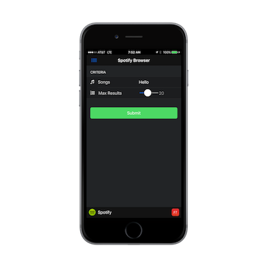
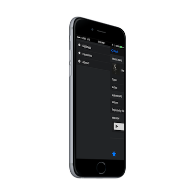
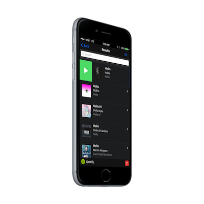
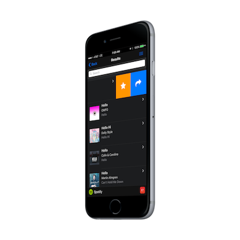

## What You Will Build
In this workshop you will learn how to create a mobile app that interacts with the Spotify Web API using PhoneGap. Some best
practices and performance techniques will be taught along the way and you will be introduced to useful plugins to add additional 
functionality that will enhance the app and provide a more native experience. 

<!---->

## Dependencies
We will be using PhoneGap, [Framework7](http://www.idangero.us/framework7) and the [Font Awesome Icon Font library](http://fortawesome.github.io/Font-Awesome/)
 to help us build this app. The following plugins are also used in the final version. 
  
      <plugin name="cordova-plugin-whitelist" spec="~1.2.0" />
      <plugin name="cordova-plugin-statusbar" spec="~1.0.1" />
      <plugin name="cordova-plugin-media" spec="~1.0.1" />
      <plugin name="cordova-plugin-console" spec="~1.0.1" />
      <plugin name="cordova-plugin-x-socialsharing" spec="~5.0.9"/>

## What You Will Learn
- Common mobile app development paradigms (navigation, view stacks, routing) and how to implement them.
- How to implement templates to set up a single page architecture.
- How to use PhoneGap plugins in your mobile apps.
- How to interact with the Spotify REST api to retrieve data. 
- Tips on handling specific mobile challenges to make your apps feel native and perform well. 
- How to configure your apps (preferences, whitelisting etc). 

## Requirements

- To complete this workshop, all you need is a code editor, a modern browser, and a connection to the Internet.

- A working knowledge of HTML and JavaScript is assumed, but you don't need to be a JavaScript guru.

>A mobile device or a Mobile SDK is **not** a requirement for this tutorial. You will able to test your application in the browser or with the 
[PhoneGap Developer App](app.developer.com) with some limitations. If you want the full support of the native APIs then you will need the mobile 
SDK for that platform (iOS SDK, Android SDK, etc.) installed on your system. 

## Useful Resources
1. [Pocket Guide](http://hollyschinsky.github.io/pocket-guide) - a similar app and workshop with a vanilla approach to a single page architecture and walks through specific
tips and tricks to make your app feel and perform natively outside of a specific UI framework doing the work for you. 
2. [PhoneGap Workshop](http://hollyschinsky.github.io/phonegap-workshop) - a similar app with a workshop that goes step by step creating the routing, templates and views to understand Single Page Architecture. 
3. [Conference Tracker](http://hollyschinsky.github.io/ConferenceTracker) - a conference app built with Ionic/AngularJS with some more advanced features

## Issues/Feedback

- Please create an issue [here](https://github.com/hollyschinsky/spotify-browser/issues) if you run
into any problems or if you have feedback.

- You can also use the Comments section at the bottom of each module to ask a question or report a problem.

- You can contact me on Twitter:

    <a href="https://twitter.com/devgirlfl" class="twitter-follow-button" data-show-count="true" 
    data-size="large" data-lang="en">Follow 
    @devgirlfl</a>
    

<a href="module1.html" class="btn btn-default pull-right">Next <i class="glyphicon
glyphicon-chevron-right"></i></a>

