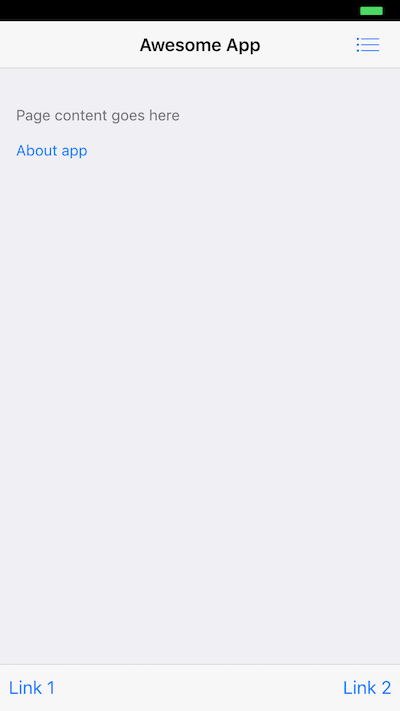
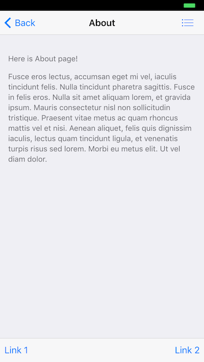
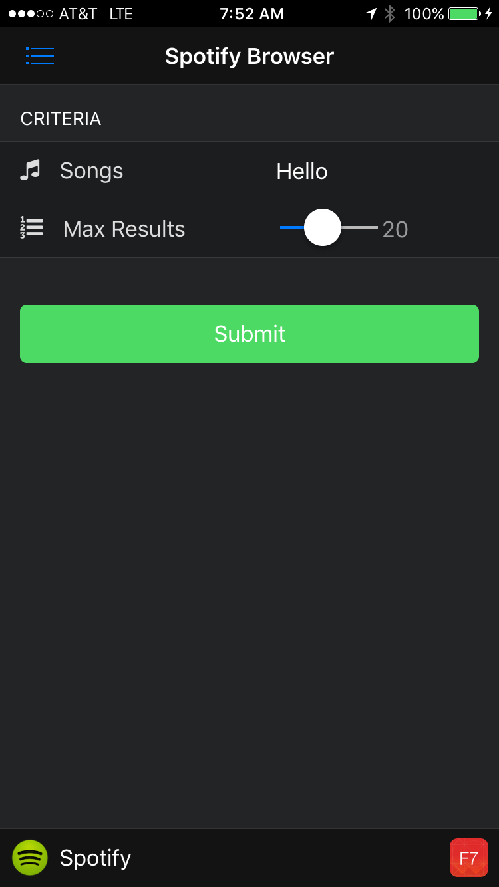

### Download Final App Project
The final application source for the project we'll be building in this workshop is located [here](https://github.com/hollyschinsky/spotify-browser).

If you haven't done this prior to the workshop, download the zip file for the [starter project](https://github.com/hollyschinsky/spotify-browser/archive/master.zip) 
or clone it with git:
   
         $ git clone https://github.com/hollyschinsky/spotify-browser
           
There's a **[solutions](https://github.com/hollyschinsky/spotify-browser/tree/master/solutions)** folder you can use as a reference for each
 module but try to go through and do each step yourself for a better learning experience. If you get stuck then you can simply replace your root project's **www** and **config.xml** with those in the solutions folder from the module
 we're working on.

### Create a new Project
Create a PhoneGap project using the PhoneGap CLI with the steps you learned in the beginner's workshop. In this workshop we're also
going to use the `--template` flag and tell PhoneGap to create our project based on a simple Framework7 template now available: 
        
    $ phonegap create spotifyApp --template phonegap-template-framework7      
       
The above command will create a basic project with a default name and id. If you would like to specificallly set the name and id, use the following
command to create your project with your desired parameters:
          
    $ phonegap create spotifyApp --template phonegap-template-framework7 --name spotify-app --id com.mycompany.spotifyapp

> You can view other template options using the `$ phonegap template list` command.

### Serve the App
First let's test out the newly created app to ensure we see the basic template before moving on. We'll use the `serve` command to start up a 
local web server for us to try it out. 
        
2. Navigate into the newly created project folder

        $ cd spotifyApp

3. Serve the app using the PhoneGap serve command
                
        $ phonegap serve

4. Use the PhoneGap Developer app to connect to the ip address returned, or simply open it in your browser.  
                        
5. Ensure you see the application is shown and looks like what you see below: 

   
   

>Use the Chrome Developer tools at any time during this workshop to help debug any issues. Open it with Alt+Cmd+I or via the View->Developer menu. 

### Add Font Awesome Icon Library

Framework7 comes pre-defined with some basic icons but will support other icon libraries like [Font Awesome](http://fortawesome.github.io/Font-Awesome/ 
and [Ionicons](http://ionicons.com/).

1. Locate the final project you downloaded and copy the `www/lib/font-awesome` folder into your `www/lib` folder.
   
2. Open `index.html` and add the reference to include the stylesheet link just before the styles.css stylesheet in the HTML header.   
      
        <link rel="stylesheet" href="lib/font-awesome/css/font-awesome.min.css">
        
3. To use Framework7 icons, specify the `icon` class first followed by the name of the icon definition (from the Framework7 CSS defintion):
        
        <!-- Using Framework7 Icons -->
        <i class="icon icon-bars"></i>

4. To use the Font Awesome icons, specify the `icon` and `fa` class followed by the name of the icon you want to use. Find all the icons available
[here](http://fortawesome.github.io/Font-Awesome/icons/). 
        
        <!-- Using Font Awesome Icons-->
        <i class="icon fa fa-star"></i> 

### Setup Trouble?        
If you have any problems with setting up your project based on the above, remember you can simply copy over the files located in the **[solutions](https://github.com/hollyschinsky/spotify-browser/tree/master/solutions)** 
module1 starter folder into your project's root (overwrite them) and start from there. 

### Bonus Step: Run the Final Application
Try out the final app.  

1. Open the `index.html` of the `www/root` in a browser to get a better idea of how it works, though there will be some limits to what you can do.
1. Better yet, serve and pair with the PhoneGap Developer App from the PhoneGap CLI or PhoneGap Desktop:  
  
   - **From PhoneGap CLI** 
     1. Locate where you downloaded the **spotify-browser** project from my GitHub and navigate into the root from the command line          
     2. Run `$ phonegap serve`
     3. Connect to the URL reported from the `serve` command in the PhoneGap Developer app on a mobile device (or in a browser)

     
   - **From PhoneGap Desktop**
     1. Locate where you downloaded the **spotify-browser** project from my GitHub and add it to PhoneGap Desktop by clicking the **+** button
     and selecting *Open Existing Project* to choose it. 
     2. Click the play **>** button if your project is not active 
     3. Connect to the URL reported from PhoneGap Desktop in the PhoneGap Developer app on a mobile device
            
   - **Advanced Option:** those with proper local setup can run on device/emulator with PhoneGap CLI with one of the following:
        
            $ phonegap run ios
            $ phonegap run ios --device
            $ phonegap run android             
            $ phonegap run android --device               
      
      >This option requires a mobile SDK setup. If you have Mac and Xcode you should be able to use iOS, but Android requires [additional SDK installation and setup](http://developer.android.com/sdk). 

       **NOTE:** If you don't have the PhoneGap Developer App, you can still run the app in your browser by opening the `index.html` file in the browser, you will just have limited 
       functionality.    

    *If you see an **EADDRINUSE** error then you ar still serving another project on the same port and need to stop it.*

2. Ensure you see the application is shown and looks like what you see below: 

      
 

<a href="index.html" class="btn btn-default"><i class="glyphicon glyphicon-chevron-left"></i> Previous</a>
<a href="module2.html" class="btn btn-default pull-right">Next <i class="glyphicon
glyphicon-chevron-right"></i></a>

