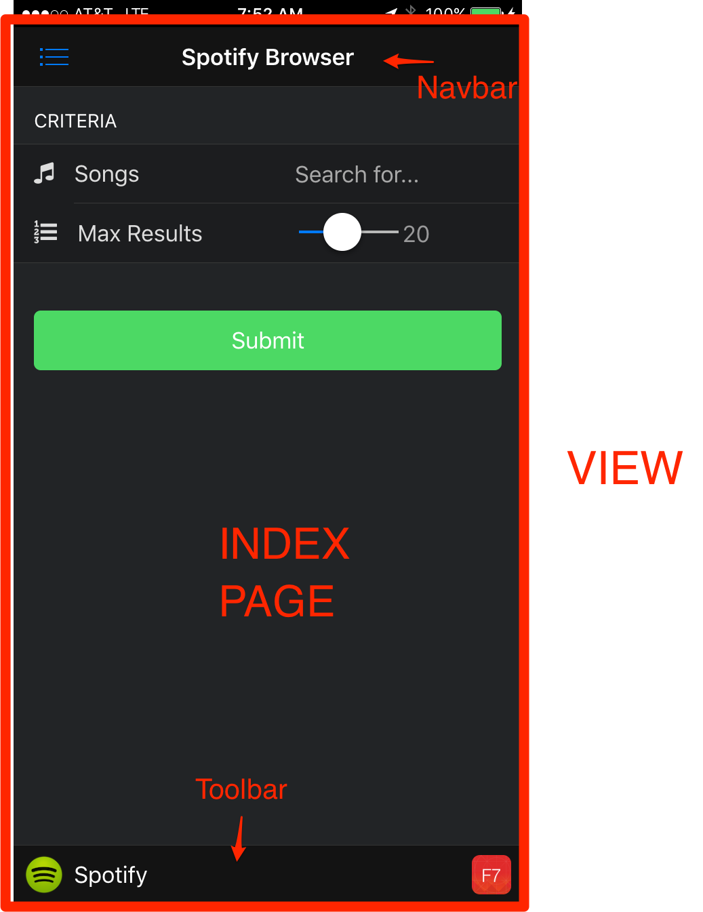

## Overview
In this module you will learn how to set up your app structure, including the headers, main view, toolbars and Framework7 initialization code.
Check out [the Framework7 website](http://www.idangero.us/framework7/docs) docs and examples apps for more details.

### Framework7 Views and Pages
1. **Views** - The wrapper container for all visual views. Only one `views` element is allowed

2. **View** - A separate visual part of app with its own settings, navigation and history. You must have a default view with class `view-main` since it's
the default where all pages are loaded into.  

3. **Pages** - A wrapper container for pages within a single view.

4. **Page** - Similar to a web page, this is what we're transitioning between. There can be many pages within a single view.

>Based on the above terminology, in our Spotify Browser App we are using one View (stack of pages) and we navigate between these pages
 by loading different templates into the main view container along with the required data to bind to that page so the expressions are
 properly evaulated. 
 
 

### Steps

1. Open `index.html` and give the app a dark theme by adding the F7 `layout-dark` class to the `<body>` tag:
 
        <body class="layout-dark">
        
   >Refresh the app or open it if it's running in your browser and check to see the change to the look of the app. 

2. Next, we'll define our main views and page. The main page will have a few form controls on it to help allow the user to enter search 
criteria. Replace the block of code starting under the `<!--Views-->` comment and ending just before the cordova.js `<script>` include with:
    
        <div class="views">
            <!-- Main view-->
            <div class="view view-main">
                <!-- Top Navigation Bar-->
                <div class="navbar" >
                    <div class="navbar-inner">
                        <!-- Home navbar -->
                        <div class="left ">
                            <!-- Left side navbar contains only icon -->
                            <a href="#" class="link icon-only open-panel">
                                <i class="icon icon-bars"></i>
                            </a>
                        </div>
                        <div class="center sliding">Spotify Browser</div>
                    </div>
                </div>
    
                <!-- Pages -->
                <div class="pages navbar-through toolbar-through">
                    <!-- Page, data-page contains page name-->
                    <div data-page="index" class="page">
    
                        <!-- Scrollable page content-->
                        <div class="page-content">
                            <div class="content-block-title">Criteria</div>
                            <div class="list-block">
                                <ul>
                                    <li>
                                        <div class="item-content">
                                            <div class="item-media"><i class="icon fa fa-music"></i></div>
                                            <div class="item-inner">
                                                <div class="item-title label">Songs</div>
                                                <div class="item-input">
                                                    <input id="term" type="text" placeholder="Search for..." value=""/>
                                                </div>
                                            </div>
                                        </div>
                                    </li>
    
                                    <li>
                                        <div class="item-content">
                                            <div class="item-media"><i class="icon fa fa-list-ol"></i></div>
                                            <div class="item-inner">
                                                <div class="item-title label">Max Results</div>
                                                <div class="item-input">
                                                    <div class="range-slider">
                                                        <input id="numResults" type="range" min="0" max="50" value="20" step="1"/>
                                                    </div>
                                                </div>
                                                <div class="item-input rangeVal">
                                                    <input id="sliderVal" type="text" disabled value="20">
                                                </div>
                                            </div>
                                        </div>
                                    </li>
                                </ul>
                            </div>
                            <div class="content-block">
                                <div class="row">
                                    <div class="col-100">
                                        <input id="btnSearch" type="button" value="Submit" class="button button-big button-fill color-green"/>
                                    </div>
                                </div>
                            </div>
                        </div>
                    </div>
                </div>
    
                <!-- Bottom Toolbar on every view unless no-toolbar class specified (see item template)-->
                <div class="toolbar">
                    <div class="toolbar-inner">
                        <a href="http://www.spotify.com" class="link external">
                            <i class="icon icon-spotify"></i>
                            <p class="color-white">&nbsp;Spotify</p>
                        </a>
    
                        <a href="http://www.idangero.us/framework7" class="link external">
                            <i class="icon icon-f7"></i>
                        </a>
                    </div>
                </div>
            </div>
        </div>

3. This app uses a spotify icon in the toolbar (via the `icon-spotify` class below) that's currently not defined and will not display 
unless it's added. 
   - Copy the `spotify.png` file from the `www/img` folder in the final project and add it into the `www/img` folder of your working 
project.
   - Now open your `styles.css` file in the `www/css` folder and add the style definition for it.
 
        ```i.icon.icon-spotify {
             width: 29px;
             height: 29px;
             background-image: url("../img/spotify.png");
             margin-right: 3px;
         }```
     

   >Refresh your browser to see the new page. Notice the controls don't actually do anything yet and if you try to drag the slider left/right it 
   will not update the value. 

3. Now set up the Framework7 initialization code. Open `www/js/my-app.js` and replace the current Framework7 
initialization code and `mainView` setup with the following code block, ending just before the `deviceready` event handler.

        var myApp = new Framework7({
            precompileTemplates: true,
            template7Pages: true,
            modalTitle: "Spotify Browser"
        })
        
        var $$ = Dom7;
        
        var mainView = myApp.addView('.view-main', {
            dynamicNavbar: true,
            domCache: true
        });

   >The *modalTitle* is the default string to use for all alerts and modals in the application. 
        
4. Next, while still in `my-app.js`, add the following change handler to update the slider text value. You can add the function just
 before the `deviceready` event handler. 
        
        $$(document).on('input change', 'input[type="range"]', function (e) {
            $$('input#sliderVal').val(this.value);
        })

   >Test to ensure the slider now updates the value before moving on to the next step.  

5. Go ahead and remove the rest of the code in `my-app.js` after the `deviceready` handler since we will not be using anything with the `about.html`
page. The final block of code in `my-app.js` should look like this at the end of this step:

        var myApp = new Framework7({
            precompileTemplates: true,
            template7Pages: true,
            modalTitle: "Spotify Browser"
        })
        
        var $$ = Dom7;
        
        var mainView = myApp.addView('.view-main', {
            dynamicNavbar: true,
            domCache: true
        });
                
        $$(document).on('input change', 'input[type="range"]', function (e) {
            $$('input#sliderVal').val(this.value);
        })
        
        // Handle Cordova deviceready event
        $$(document).on('deviceready', function() {
            console.log("Device is ready!");
        });

6. Ensure you see the application is shown and looks like what you see below:

         

<div class="row" style="margin-top:40px;">
<div class="col-sm-12">
<a href="module1.html" class="btn btn-default"><i class="glyphicon glyphicon-chevron-left"></i> Previous</a>
<a href="module3.html" class="btn btn-default pull-right">Next <i class="glyphicon
glyphicon-chevron-right"></i></a>
</div>
</div>
