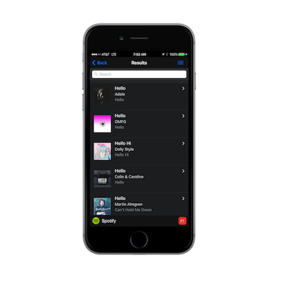

### Overview
This is a 2-part module where you will implement the submit button handling from our main view to call the Spotify API in Part 1 and then
 create your list template to load the data into in Part 2. 
  
  
  
### Part 1
  
1. Open **my-app.js** and add the following code block to handle the submit button using page level events:

        $$(document).on('click', '#btnSearch', function (e) {
            var term = $$("#term").val();
            if (term.length==0) {
                myApp.alert("Please enter a search term.");
            }
            else {
                var mediaType = "track";
                var numResults = $$("#numResults").val()
        
                var url = "https://api.spotify.com/v1/search?q=" + term +"&type=" + mediaType + "&limit=" + numResults;
                $$.ajax({
                    dataType: 'json',
                    url: url,
                    success: function (resp) {
                        console.log("Items returned: " +  resp.tracks.items);                         
                    },
                    error: function (xhr) {
                        console.log("Error on ajax call " + xhr);
                    }
                });
            }
        })
        
    >Note: you could handle this inside a page level event as well        

2. Run this in the browser and make sure you're getting results back in the success function.

###Part 2

1. Open index.html and add the following template for the list view just before the cordova.js `

2. Change the ajax `success` function to use the new template and data:

        success: function (resp) {
            myApp.template7Data = resp.tracks.items;
             mainView.router.load({
                template: Template7.templates.listTemplate,
                context: myApp.template7Data
            });
        },

3. Now try running the app to ensure you get back list results based on your search. Your list view should look something like the following:

  

<a href="module2.html" class="btn btn-default"><i class="glyphicon glyphicon-chevron-left"></i> Previous</a>
<a href="module4.html" class="btn btn-default pull-right">Next <i class="glyphicon
glyphicon-chevron-right"></i></a>

