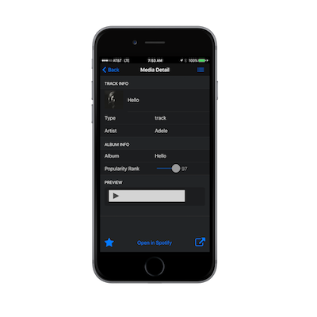
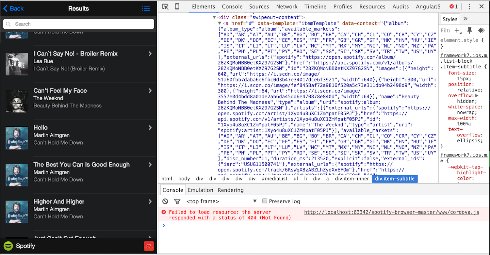
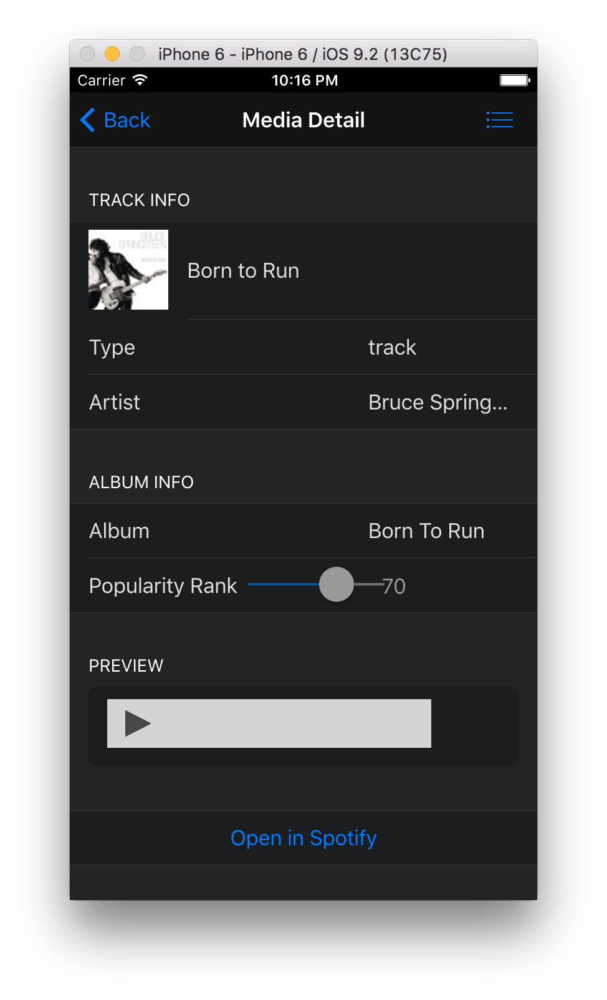

### Overview
In this module you will add a template to display the details of a track selected from the list view.

 
## Steps
1. Open **index.html** and add the following template for the media item detail after the list template created in the previous step.
        
        

2. Now that we have our new item template, we need to use it. We want to display this view when a list item is clicked on, so we'll revisit the 
 list template to locate the specific link element for an item. The original link looks like this: 
    
        <a href='#' class="item-content item-link">

  We can add the `data-template` and `data-context` attributes to it to specify a template to load and the data to bind to it, similar to how we
  told the router this information via JavaScript for the list view. (See [this link](http://www.idangero.us/framework7/docs/template7-pages.html#.VqbGC1MrKjR) 
  for data-template and data-context info).
   
  Specify the name of the template `itemTemplate` and use `{{this}}` as the expression to bind to for the data, since it refers to the current 
  data item.  See [this link](http://www.idangero.us/template7/#.VqbGCVMrKjQ) for more details on other variables and syntax you can use in Template7. 

    <a href='#' class="item-content item-link" data-template='itemTemplate' data-context='{{this}}'>    
  
2. There's one more thing we need to do before this will all work properly, and that is to properly format our data using a template helper. 
 The data being passed in the `data-context` attribute above is currently a JavaScript object since we iterated through an Array of objects
 to build the list, and we're referencing the current context of `this` which is just a singular object from that Array. 
 
        <a href="#" data-template="itemTemplate" data-context="[object Object]" class="item-content item-link">
                                     
 It will try to bind expressions literally from the string `[object Object]` and will fail with an `Uncaught SyntaxError: Unexpected token o`.
 Instead, we need to use the JSON stringify method to convert it to valid JSON. We can define something called a *helper* to fix this issue. A 
 helper is a function that is called before the data is bound to the template to pre-process it. There are pre-defined ones or you can define 
 your own. See [this link](http://www.idangero.us/template7/#.VqbGCVMrKjQ) for more information on the syntax. 
 
 Before we move on, we should add one more formatting detail into our `stringify` helper. Sometimes the wrong type of apostrophe is returned 
 and it will cause an error depending on what you searched. We can use regex to do a replace on any of these invalid apostrophe's
 and set it to the standard HTML apostrophe (`&#39;) to fix it.  
 
 **Important:** Template helpers need to be defined before the app is initialized, so be sure to add this to the ***top*** of the **my-app.js** 
 file. 

    Template7.registerHelper('stringify', function (context){
        var str = JSON.stringify(context);
        return str.replace(/'/g, '&#39;');
    });

3. Now we need to specify where we want to use the helper in the template. We need to format the data being passed into the *itemTemplate*, so 
open index.html and add it into the `data-context` attribute before the `this` object (be sure to leave a space too). The helper will then be applied to 
your data item and you will see the results  Open the index.html file and add the `stringify` attribute as shown below:
 
        <a href='#' class="item-content item-link" data-template='itemTemplate' data-context='{{stringify this}}'>
        
    Optionally inspect an item in your browser to view the  actual data on the item to have a better understanding of what's happening
    here. Notice the JSON data displayed now as the value of the `data-context` attribute. 
            
    
         
2. Now run your app and ensure you can navigate into this new detail view when a list item is clicked. 

    
 
3. Also, try clicking on the Preview button to ensure you hear audio playing.

4.. You may notice some of the formatting of the controls could be nicer. If you want to fix it, there are some styles set up in the final project **www/css/styles.css** file you 
can copy into yours now to make it more presentable.   
 
 
    
### Bonus Step  
1. If you have the PhoneGap CLI setup to build locally with a platform SDK, try using it to run your app on the emulator or a device:

        $ phonegap run ios
        $ phonegap run android
           

<a href="module3.html" class="btn btn-default"><i class="glyphicon glyphicon-chevron-left"></i> Previous</a>
<a href="module5.html" class="btn btn-default pull-right">Next <i class="glyphicon
glyphicon-chevron-right"></i></a>

