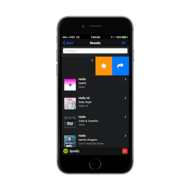

### Overview
In this step we'll add some common mobile UX features to our app to make it more useful; menus (aka side-drawer navigation) and swipeouts.  
 
## Side Menu
A common mobile pattern for navigation is to use a slide-out menu (otherwise known by Google as a navigation drawer). 

 

Let's add support for one now with some very basic event handling.
 
1. Open index.html and locate the `view-main` section.  Add the following code:

        <!-- Left panel menu with reveal effect (could also use a panel-cover effect)-->
        

            

                <ul>
                    <li id="settings">
                        

                            
 <i class="icon fa fa-cog"></i>

                            

                                
Settings

                            

                        

                    </li>
                    <li id="favorites" >
                        

                            
<i class="icon fa fa-star"></i>

                            

                                
Favorites

                            

                        

                    </li>
                    <li id="about">
                        

                            
<i class="icon fa fa-info-circle"></i>

                            

                                
About

                            

                        

                    </li>
                </ul>
            

        

 

## Swipeouts

Now let's add swipeout handling to our list template to allow a user to do various actions without leaving the list. 

1. Open index.html, locate the list template definition and change this section to:
   
            <li class="swipeout">
               

                   <a href='#' id='mediaItem{{@index}}' data-template='itemTemplate' data-context='{{stringify this}}'
                      class="item-content item-link">
                       

                           
                       

                       

                           

                               
{{name}}

                           

                           
{{artists[0].name}}

                           
{{album.name}}

                       

                   </a>
               

               

                   <a href="#" class="bg-orange favorite" data-item="{{@index}}"><i class="icon fa fa-star fa-2x"></i></a>
                   <a href="#" class="bg-blue share" data-item="{{@index}}"><i class="icon fa fa-share fa-2x"></i></a>
               

               

                   <a href="#" class="bg-green preview" data-item="{{@index}}"><i class="icon fa fa-play fa-2x"></i></a>
               

           </li>

<a href="module4.html" class="btn btn-default"><i class="glyphicon glyphicon-chevron-left"></i> Previous</a>
<a href="module6.html" class="btn btn-default pull-right">Next <i class="glyphicon
glyphicon-chevron-right"></i></a>

