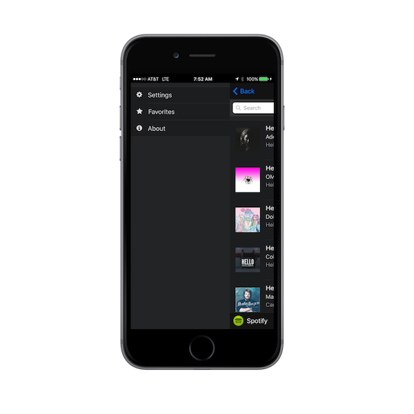
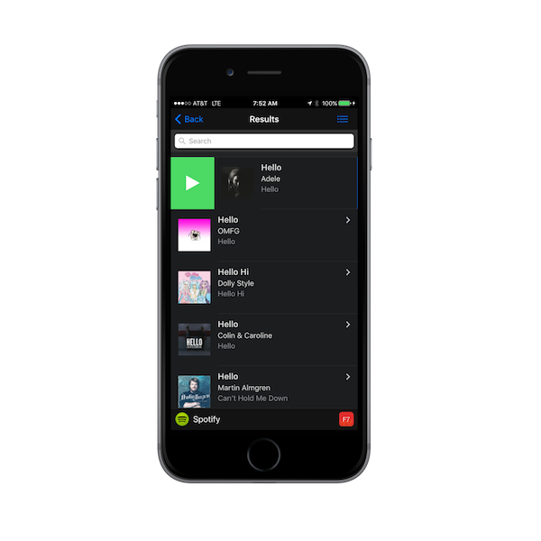
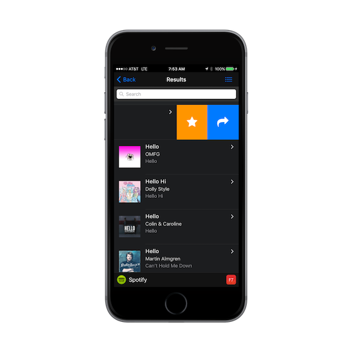
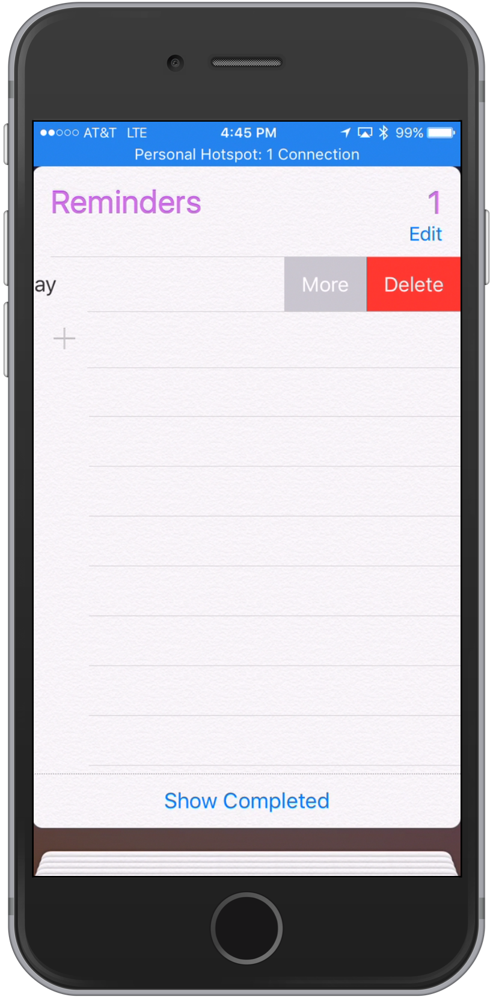

### Overview
In this step we'll add some common mobile UX features to our app to make it more useful; menus (aka side-drawer navigation) and swipeouts.  
 
## Side Menu

The decision to use a slide-out menu (also known as a [navigation drawer](https://www.google.com/design/spec/patterns/navigation-drawer.html)
or hamburger menu) is widely debated, but it has been a common mobile pattern in the recent past. It might be best used for less commonly used
actions where you don't want to use important screen real estate.  
  
 
 
Let's look at how Framework7 supports panels to create a side panel menu with some basic event handling. Since we started with a basic 
Framework7 template initially, we already have some placeholder code for a panel. 

1. Open `index.html` and locate the `

` section.  Currently there's a left panel already defined with a simple
element in it that we can replace with our menu list. Modify the existing panel code to define the following content menu list:   

        

        <!-- Left panel with reveal effect-->
        

            

                <ul>
                    <li id="settings">
                        

                            
 <i class="icon fa fa-cog"></i>

                            

                                
Settings

                            

                        

                    </li>
                    <li id="favorites" >
                        

                            
<i class="icon fa fa-star"></i>

                            

                                
Favorites

                            

                        

                    </li>
                    <li id="about">
                        

                            
<i class="icon fa fa-info-circle"></i>

                            

                                
About

                            

                        

                    </li>
                </ul>
            

        

   >Notice the panel has a `reveal` effect. You could change it to `panel-cover` to try out that effect instead.
   
   

2. Now we need to add handling for each of these menu list items. Each of them has an id we can use to add a click event to. 
Open `my-app.js` and add the following basic click handlers to the end of the file for each of the id's:
 
    
        $$(document).on('click', '#favorites', function (e) {
            myApp.alert('Show my favorites');
        });
        
        $$(document).on('click', '#about', function (e) {
            myApp.alert('Show About');
        });
        
        $$(document).on('click', '#settings', function (e) {
            myApp.alert('Show Settings');
        });

3. **Extra credit:** Add a template to handle the About page that is loaded when the menu item is clicked. 
(Use the [Framework7 docs](http://www.idangero.us/framework7/docs) as a reference). 

## Swipeouts

Now let's look at how we can use swipeout handling with Framework7. Swipeouts are a common pattern that allow a user to swipe left or 
right to uncover further actions to take on a list item. Notice the colored buttons shown on the list items below. 

   

   The iOS Reminders app is another good example of using swipeouts:
   
   

1. Open `index.html`, locate the list template definition and take a look at the parts with `swipeout` related classes. 
   
            
            <li class="swipeout">
               

                   <a href='#' id='mediaItem{{@index}}' data-template='itemTemplate' data-context='{{stringify this}}'
                      class="item-content item-link">
                       

                           
                       

                       

                           

                               
{{name}}

                           

                           
{{artists[0].name}}

                           
{{album.name}}

                       

                   </a>
               

               

                   <a href="#" class="bg-orange favorite" data-item="{{@index}}"><i class="icon fa fa-star fa-2x"></i></a>
                   <a href="#" class="bg-blue share" data-item="{{@index}}"><i class="icon fa fa-share fa-2x"></i></a>
               

               

                   <a href="#" class="bg-green preview" data-item="{{@index}}"><i class="icon fa fa-play fa-2x"></i></a>
               

           </li>
           

2. In the above definition we have buttons in the `swipeout-actions-right` and `swipeout-actions-left` that require some handlers to invoke code to actually do something when clicked. In this
step we will add the handling for them. 

   **NOTE:** The **data-item="{{@index}}"** syntax will pass the index of the item clicked on so we can then reference the right item in the code.  
 
3. Add a Page Init handler to use for setting up events we want to handle on the list page specifically. 
    
        myApp.onPageInit('list', function (page) {
        
        });'
        
4. Add Favorites Handler - the `star` button indicates that the user can add this item as a favorite. Open `my-app.js` and add the following into the list page
 init handler created in the previous step `myApp.onPageInit('list', function (page) {...`

        $$(page.container).find('.favorite').on('click', function (e) {
            var item = page.context[this.dataset.item]; //this.dataset.item returns data held in data-item attribute set in template
            myApp.alert(item.name + ' added to favorites!');
        });
              
   >Note the use of the `page.context[this.dataset.item];` As mentioned above, we passed the index of the current item clicked on the `data-item` attribute. Here 
   we use it to retrieve that index from the page context. The page context is the array of results we received and supplied for the list template.
        
     
5. Add Preview Handler - the left swipeout `play` button indicates the user can click it to play a preview of this item. Open`my-app.js` and add the following into 
the list page init handler as well:

        $$(page.container).find('.preview').on('click', function (e) {
            var item = page.context[this.dataset.item]; //this.dataset.item returns data held in data-item attribute set in template

            myApp.alert("Previewing " + item.name);
            var media = new Media(item.preview_url, function () {console.log("Media Success");},function (error)
                {console.log("Media fail " + error)},null);
            media.play();
            setTimeout(function() {media.stop()},7000) //preview for 7 seconds
        });
        
##### Dependencies
  The preview feature above requires the Media Plugin. If you're testing with the PhoneGap Developer app on your mobile device, then it's already 
  configured for you in the sandboxed environment. If you're running locally with the CLI however, be sure to add the plugin. 
    
   - [Media Plugin](https://github.com/apache/cordova-plugin-media)
           
            $ phonegap plugin add cordova-plugin-media --save

  >This command will also add the Cordova File Plugin by default since it's a required dependency. 
    
6. You may notice there's also a `Share` swipeout button but we will be handling that in a later module since it requires a 3rd party plugin. 
    
7. Run the app to make sure you see the click events firing when you tap on the Preview and Favorites buttons in the swipeouts.
 
  >Based on the F7 docs, the swipeout support will not work well in the browser so you should test this feature via the PhoneGap Developer App or the CLI locally.
    

<a href="module4.html" class="btn btn-default"><i class="glyphicon glyphicon-chevron-left"></i> Previous</a>
<a href="module6.html" class="btn btn-default pull-right">Next <i class="glyphicon
glyphicon-chevron-right"></i></a>

