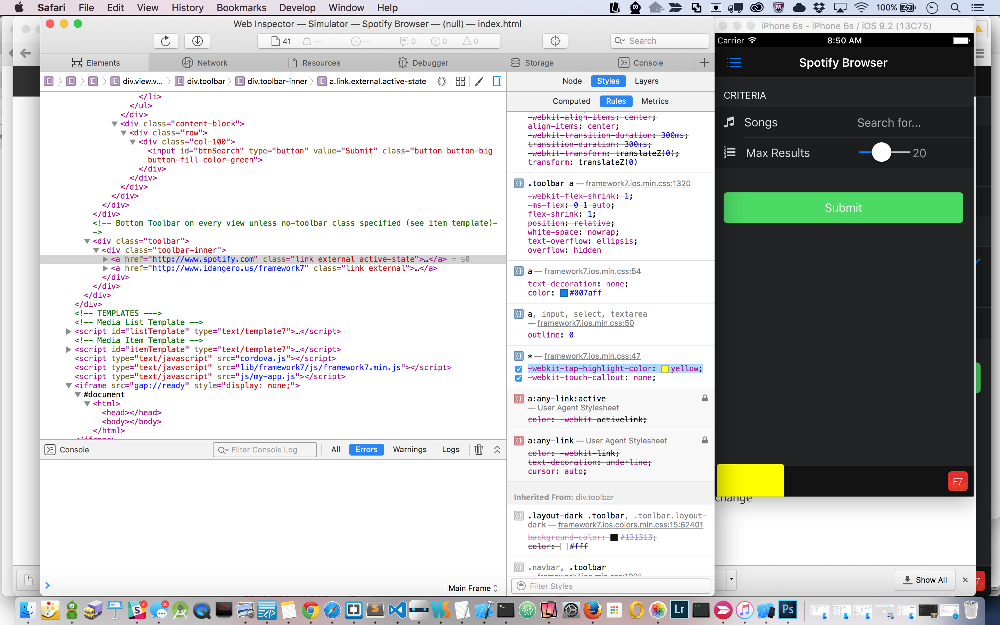
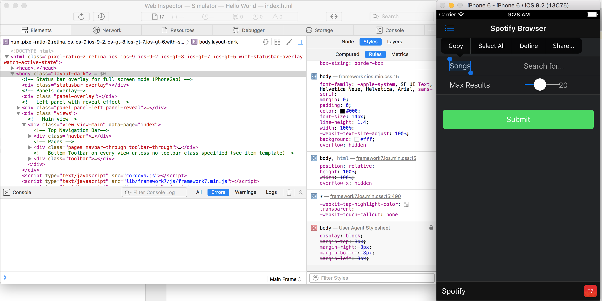
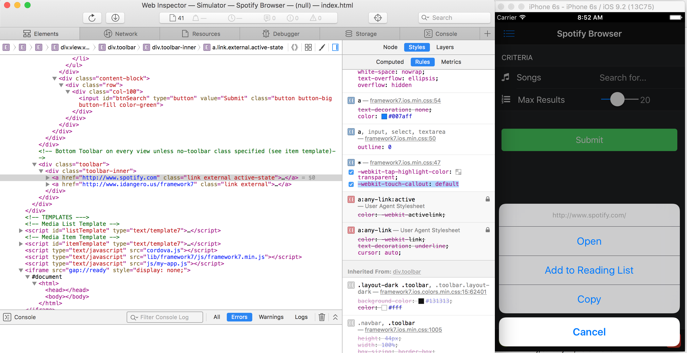
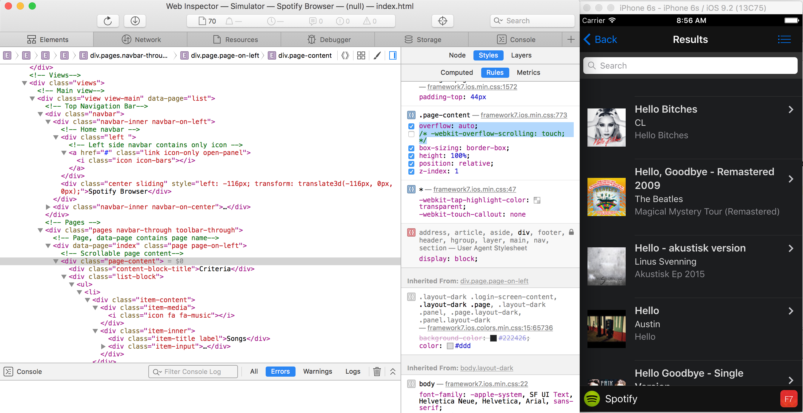
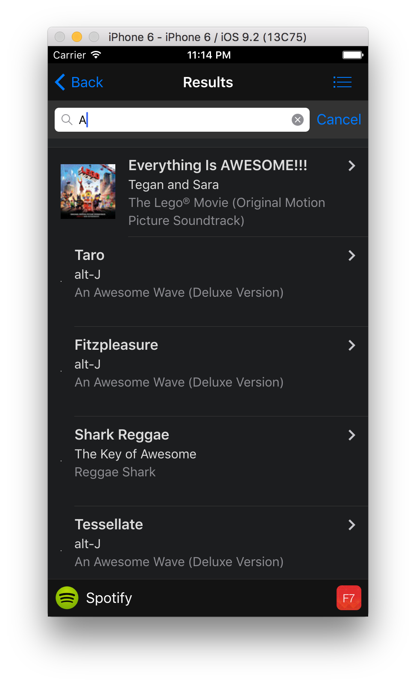

### Overview
In this module we're going to discuss ways to make your app feel and act native. Much of the tips included here are built into Framework7 so you
will not need to implement them in this particular app but it's important to be aware of them when building hybrid apps. 

## CSS Tips for a Native Feel
1. Remove tap highlight 

    
        
        -webkit-tap-highlight-color: rgba(0,0,0,0);
        -webkit-tap-highlight-color: transparent;

1. Disable user selections on actionable elements (for instance a select on a long tap)

    
    
    Fix with:
	    
	    -webkit-user-select: none;		 

    Use the following `<meta>` tag in your index.html for Microsoft platform support:
  		  
        <meta name="msapplication-tap-highlight" content="no">
		
   >Keep `-webkit-user-select: text;` for text input fields or you won't be able to edit your text.

1. Remove the glossy appearance from controls on iOS (gives flat design look)   
   
   
  
   Fix it with:
      
      `-webkit-appearance: none;` 
             	   
      	   
3. Disable touch callout (default callout that displays when you hold down on a link)
   
   
 
        -webkit-touch-callout: none
        
   >See this article:[Touch callout disabled](http://phonegap-tips.com/articles/essential-phonegap-css-webkit-touch-callout.html)

3. Use Native Scrolling - if the UI framework you're using doesn't have this set on the classes you're using for your containers you should
 set it. 
   
    

        -webkit-overflow-scrolling: touch; 
        
   >On Android 4+ every scrollable container has momentum scrolling.
      
 4. Use System Fonts
 
  - iOS: `font-family: 'Helvetica Neue', Helvetica, Arial, sans-serif;`
 
  - Android: `font-family: 'RobotoRegular', 'Droid Sans', sans-serif;`
 
  - Windows Phone: `font-family: 'Segoe UI', Segoe, Tahoma, Geneva, sans-serif;`    

>All of the tips in the above list are already built into Framework7 but important to understand when building hybrid apps.   

#### Optional
If you're running an app through the CLI on a native simulator or device (outside of PhoneGap Developer), you can test this out with Safari 
developer tools. Open up to inspect and modify some of the CSS properties applied from the Framework7 CSS.
 
1. Change tap highlight to a color instead of transparent, such as `-webkit-tap-highlight-color: green;`. Then try clicking on one of the external links at the bottom of the main screen.
2. Comment out `-webkit-touch-callout: none;` or change it to another value. Then hold down (long tap) on a link.
3. Comment out `-webkit-appearance: none;` 
4. While in the list view of the app, comment out the `-webkit-overflow-scrolling: touch;` property in the `.page-content` definition and notice the
 impact on the scrolling feel. 
5. Try holding down on one of the titles, like the word Songs on the main view. You will see it get selected and a menu shown to copy etc. Deselect it, 
then add `-webkit-user-select: none; to the `.body` definition in the CSS and try it again to see what happens.

## Performance Tips

1. Serve properly sized images for all different resolutions. Resolution-independent images (SVG) are a great option and scale well.
    
2. Use Hardware Accelerated animations and view transitions (trick to force them to use the GPU - faster than CPU)

        .page-on-left {
            opacity: .9;
            -webkit-transform: translate3d(-20%, 0, 0);
            transform: translate3d(-20%, 0, 0)
        }
    
        .page-on-center .swipeback-page-shadow {
            opacity: 1
        }
        
        .page-on-right {
            -webkit-transform: translate3d(100%, 0, 0);
            transform: translate3d(100%, 0, 0)
        }

  >The [Native Transitions Plugin](http://plugins.telerik.com/cordova/plugin/native-page-transitions) is a Cordova plugin to help increase the speed of your transitions.  The plugin immediately grabs a screenshot 
  of your webview (making a more lightweight view), then waits for the new content to load, and then performs the transition by animating out the 
  screenshot and in the new view.

4. Lazy loading of images and virtual lists (delay loading of images while outside of viewport until user scrolls to them)

    

5. HTML Caching (try to load pages from memory first) 
  

<a href="module5.html" class="btn btn-default"><i class="glyphicon glyphicon-chevron-left"></i> Previous</a>
<a href="module7.html" class="btn btn-default pull-right">Next <i class="glyphicon
glyphicon-chevron-right"></i></a>

