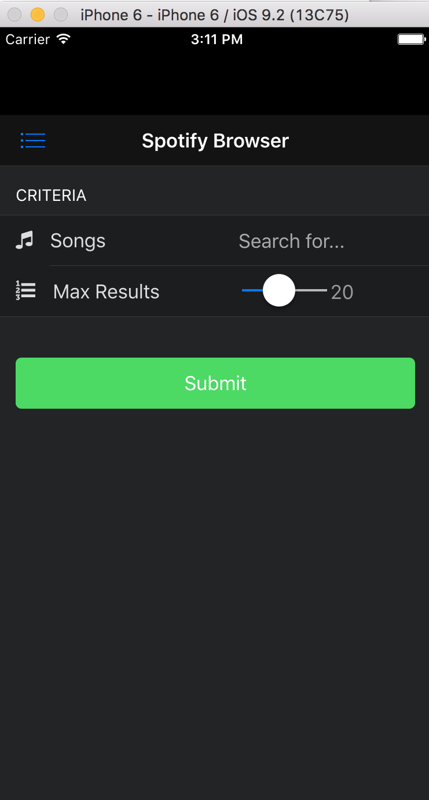

### Overview
You can configure your app with specific preferences and settings depending on the type of app you're building. In this module we'll look 
at some popular preferences and settings you should be aware of when building your apps. 

#### Common Preferences
1. Webview Bounce Effect / DisallowOverscroll

    

   By default the webview will have a bounce effect on iOS. Normally you would want your nav bar and toolbars to stay fixed though, so typically
   you'll want to disable this effect in your apps. Set this property to true in your config.xml:

        <preference name="DisallowOverscroll" value="true" />
    
2. iOS Backup Storage (defaults to iCloud)
 
        <preference name="BackupWebStorage" value="none" />

>These settings are already included in your base template project so no action is required. 

#### Content Security Policy 
The CSP is used to help secure your app and mitigate injections and vulnerabilities like cross-site scripting (XSS). You can customize it to 
whitelist approved sites amongst other things. To use it you need to ensure you have the [Cordova Whitelist Plugin](https://github.com/apache/cordova-plugin-whitelist
added to your project (already included in the base template by default) and add a meta tag to your index.html that declares the specific policy
 you want to apply for your app. 
   
  Open the `index.html` file and add the following Content Security Policy meta tag. This will allow the access required for this particcular app. 
     
     <meta http-equiv="Content-Security-Policy" content="default-src 'self' data: gap: https://ssl.gstatic.com 'unsafe-eval'; script-src * 'unsafe-eval'; style-src 'self'; media-src *; frame-src *;  img-src * data:; connect-src * 'unsafe-eval'">

2. If you plan to run on the Android platform, you should also open the `config.xml` and add this line into the Android platform-specific section:

        <allow-navigation href="http://*/*" />
                
    The end result looks like:
   
        <platform name="android">
                <preference name="android-minSdkVersion" value="14" />
                <allow-intent href="market:*" />
                <allow-navigation href="http://*/*" />
        </platform>

To learn more about how to customize it specifically, check out the [Cordova Whitelist Guide](http://cordova.apache.org/docs/en/latest/guide/appdev/whitelist/index.html)
  and [Cordova Whitelist Plugin](https://github.com/apache/cordova-plugin-whitelist/blob/master/README.md#content-security-policy).  
 Also, you can get help generating your specific header to include in the meta tag more easily using this [website](http://cspisawesome.com/). 
 

## Icons and Splash Screens

#### General Icon Support
1. Copy the `icon.png` file from the final project `www` folder into your project `www` folder. This will be the general icon to be used for the app (on home screens) and is displayed 
in PhoneGap Desktop. 

2. Now open the `config.xml` file and update the icon element to reference it. The current default from the template is `logo.png`. If it's not there at all yet for some reason, add it just 
after the `<content>` element. 
      
        <icon src="www/icon.png" />
  
### Bonus: Platform-Specific Icon Configuration
The above is fine while testing but when you're ready to actually build and package your app for submission you'll want to know how to 
configure all the different sizes needed specifically per platform. (This will vary depending on platform and version, use this as a general guideline
and see the official iOS/Android/MS docs for the latest details. 

The Ionic Framework has a great tool for making this process easy using their icon sizing service. You need to provide an image for an icon
with a size of 192x192 and another for the splash screen with a size of 2208x2208. Ionic provides Photoshop templates you can use as well.
See [this post](http://blog.ionic.io/automating-icons-and-splash-screens/) for more details on using their tool.
 
1. An icon and splash screen are included at the proper sizes in a *resources* folder in the project root starting with this module going forward. You can 
use them to run `ionic resources` and they will generate all the icons and splash screen file sizes for you and add them to the config.xml file. 
Once the CLI is used to do a build locally (for instance when you're ready to move towards production), then
these assets will all be copied down to their respective platform locations for you by having them included here. 
   
    **Note:** If you're using the Android platform, Ionic also includes the following two preferences to configure the splash screen. 
    Please see the [Cordova Splash Screen plugin](https://github.com/apache/cordova-plugin-splashscreen) for more details. 
  
        <preference name="SplashScreen" value="screen"/>
        <preference name="SplashScreenDelay" value="3000"/>

   >See the final app `config.xml` file [here](https://github.com/hollyschinsky/spotify-browser/blob/master/config.xml) to see what icons and splash screens the tool adds into the config.xml
    and all the different sizes supported. 

### Plugin Dependencies 
At this point it's worth going over all of the plugins this project relies on. You can add them into your config.xml so you have them 
when you decide to use the CLI to build locally and outside of the PhoneGap Developer app. 

        <plugin name="cordova-plugin-statusbar" spec="~1.0.1" />
        <plugin name="cordova-plugin-console" spec="~1.0.1" />
        <plugin name="cordova-plugin-whitelist" spec="~1.2.1" />
        <plugin name="cordova-plugin-media" spec="~2.1.0" />
        <plugin name="cordova-plugin-file" spec="~4.1.0" />
        <plugin name="cordova-plugin-splashscreen" spec="~3.1.0" />
        <plugin name="cordova-plugin-x-socialsharing" spec="~5.0.9" />

<a href="module6.html" class="btn btn-default"><i class="glyphicon glyphicon-chevron-left"></i> Previous</a>
<a href="module8.html" class="btn btn-default pull-right">Next <i class="glyphicon
glyphicon-chevron-right"></i></a>

