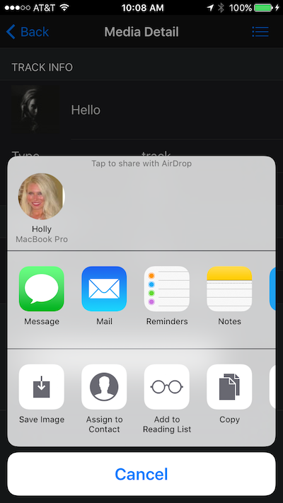
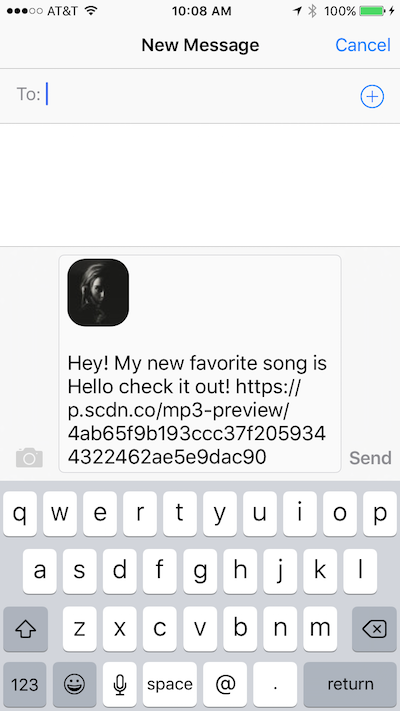

In this module we'll learn how to share a media item with a friend through messaging, email etc using the device's native sharing features. 
    
      
   
   
### Steps
Prior to this step we added the button for sharing on both the list and item detail views, however they don't actually do anything yet.
In this module we'll add event handling to allow them to use the Social Sharing plugin. 

1. Open `my-app.js` and locate the page init event handler for the *list* page (`myApp.onPageInit('list')...`). 
2. Add the following code to handle when a user clicks the share button on the swipeout. You can add it just after the preview handling:

         $$(page.container).find('.share').on('click', function (e) {
                 var item = page.context[this.dataset.item];
         
                 if (window.plugins && window.plugins.socialsharing) {
                     window.plugins.socialsharing.share("Hey! My new favorite song is " + item.name + " check it out!",
                         'Check this out', item.album.images[2].url, item.preview_url,
                         function () {
                             console.log("Share Success")
                         },
                         function (error) {
                             console.log("Share fail " + error)
                         });
                 }
                 else myApp.alert("Share plugin not found");
         });

3. There's also a share icon at the bottom of the item detail page we can implement in this step as well. In `my-app.js`, add the following block to handle `pageInit`
events for the media item detail page.  
        
        // Media Item Page Handling
        myApp.onPageInit('media', function (page) {
            var item = page.context;
        
             $$(page.container).find('.share').on('click', function (e) {
                if (window.plugins && window.plugins.socialsharing) {
                    window.plugins.socialsharing.share("Hey! My new favorite song is " + item.name + " check it out!",
                        'Check this out', item.album.images[2].url, item.preview_url,
                        function () {
                            console.log("Share Success")
                        },
                        function (error) {
                            console.log("Share fail " + error)
                        });
                }
                else myApp.alert("Share plugin not found");
            });
        });

   >Notice how we can just set the item to the `page.context` value itself since it has already been selected and passed in for this view.
 
4. There's one more icon on the bottom left bar we could add handling for at this point too, the favorites (star) icon. Add another block into the `pageInit` handler
 for the media detail page:
 
        $$(page.container).find('.favorite').on('click', function (e) {
            myApp.alert(item.name + ' added to favorites!');
        });

5. Test the buttons to make sure you see the share features for your native device. Remember, this is a 3rd party plugin so you can only test this
feature if you're running from the CLI locally. 

### Dependencies
 
-[Social Sharing 3rd Party Plugin](https://github.com/EddyVerbruggen/SocialSharing-PhoneGap-Plugin)
  
     $ phonegap plugin add cordova-plugin-x-socialsharing --save
    
  If you're using the CLI locally to build your app, you should add the required plugin shown above first. At the moment the PhoneGap Developer App does not include this plugin
  so if you're using that to view and test the app then it will not work at this time. 

  It should look something like below when you run it:

   
   
        
  >The options shown here will depend on your particular devices' native sharing options.

 

 

 <a href="module7.html" class="btn btn-default"><i class="glyphicon glyphicon-chevron-left"></i> Previous</a>
 <a href="module9.html" class="btn btn-default pull-right">Next <i class="glyphicon glyphicon-chevron-right"></i></a>
 

